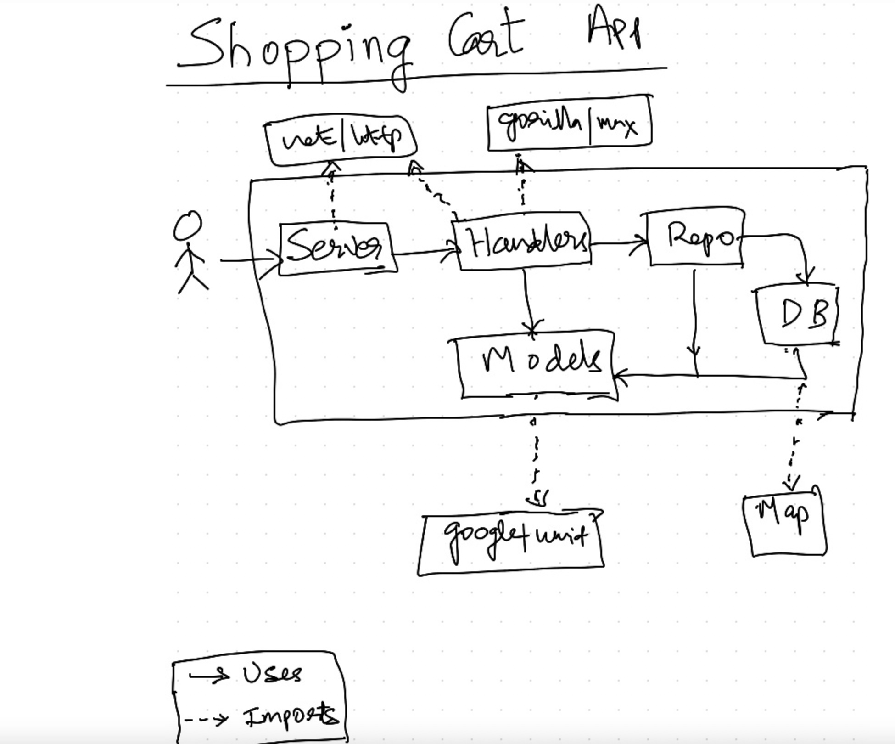

# Shopping cart  app

This is an implementation of a shopping cart to order drinks using Go concurrency primitives.

## Endpoints

- GET /
- GET /products
- POST /orders
- POST /orders/{orderId}
- POST /close
- GET /stats
- DELETE /orders/{orderId}

> Order status updates are sent to orders DB.

> Only completed orders can be reversed.

> Order status are set to ReversalRequested and then Reversed once processed.

## Architecture


## How to run?
```
# go run server.go
```

To simulate concurrent orders:-
```
# go run cmd/simulate.go
```

